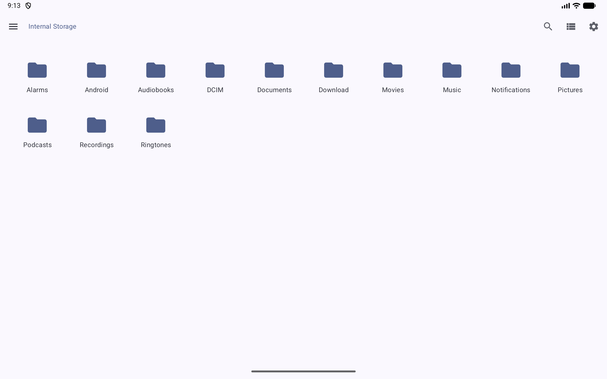
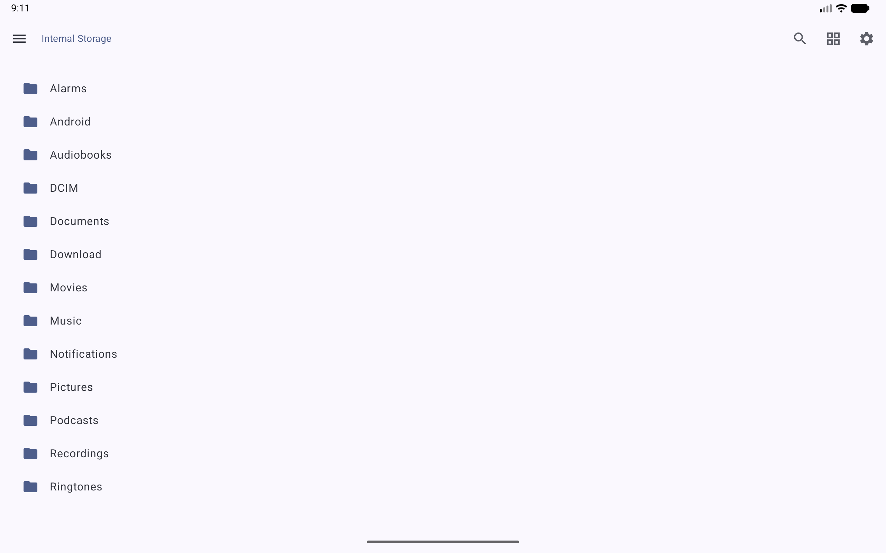
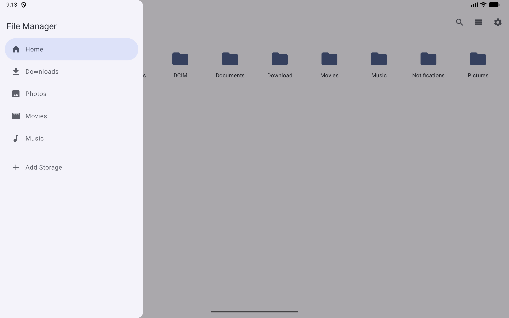

# MeldDrive 📂

[](https://opensource.org/licenses/Apache-2.0)
[](http://kotlinlang.org)
[](https://developer.android.com)
[](https://developer.android.com/jetpack/compose)

MeldDrive is a modern, powerful, and intuitive file management application for Android. It "melds" your local storage with various remote server protocols into a single, unified interface, making it easier than ever to manage your files across different platforms.

---

## 📸 Screenshots

<p align="center">
  
  
  
</p>

<p align="center">
  <i>Intuitive grid navigation | Detailed list layout | Quick access to all storages</i>
</p>

---

## 🚀 Features

- **Adaptive Layout**: Optimized for both phones and large-screen devices like tablets and foldables.
- **Unified File Explorer**: Manage your local device files and remote servers in one place.
- **Multi-Protocol Support**:
  - [x] 🖥️ **SMB (Samba/Windows Sharing)**: Connect to your PC or NAS.
  - [ ] 🌐 **WebDAV** (Planned): Access cloud services or private servers.
  - [ ] 📺 **DLNA** (Planned): Stream media from compatible devices.
  - [x] 📱 **Local Storage**: Full access to your device's internal storage.
- **View Modes**: Switch between Grid and List views to suit your preference.
- **Modern UI**: Built entirely with **Jetpack Compose** for a smooth and responsive Material 3 experience.
- **Secure**: Integrated with **Google Tink** for robust data encryption of your server credentials.
- **MVI Architecture**: Robust and predictable state management using the Model-View-Intent pattern.

## 🛠 Tech Stack

- **Language**: [Kotlin](https://kotlinlang.org/)
- **UI Framework**: [Jetpack Compose](https://developer.android.com/jetpack/compose)
- **Database**: [Room](https://developer.android.com/training/data-storage/room)
- **Preferences**: [DataStore](https://developer.android.com/topic/libraries/architecture/datastore)
- **Networking/Protocols**:
  - [smbj](https://github.com/hierynomus/smbj) for SMB support.
- **Security**: [Google Tink](https://github.com/tink-crypto/tink-java) for encryption.
- **Architecture**: MVI (Model-View-Intent)
- **Dependency Injection**: Factory-based (scalable to Hilt/Koin).

## 🏗 Build Requirements

- Android Studio Meerkat (or newer)
- JDK 17
- Android SDK 33+

## 📥 Getting Started

1. Clone the repository:
   ```bash
   git clone https://github.com/airdaydreamers/MeldDrive.git
   ```
2. Open the project in Android Studio.
3. Build and run the `app` module on an emulator or physical device.

## 📄 License

This project is licensed under the Apache License 2.0 - see the [LICENSE](LICENSE) file for details.

---

Developed with ❤️ by [Vladislav Smirnov](https://github.com/vladislav-smirnov)

```
Copyright © 2026 Vladislav Smirnov

Licensed under the Apache License, Version 2.0 (the "License");
you may not use this file except in compliance with the License.
You may obtain a copy of the License at

    http://www.apache.org/licenses/LICENSE-2.0

Unless required by applicable law or agreed to in writing, software
distributed under the License is distributed on an "AS IS" BASIS,
WITHOUT WARRANTIES OR CONDITIONS OF ANY KIND, either express or implied.
See the License for the specific language governing permissions and
limitations under the License.
```
