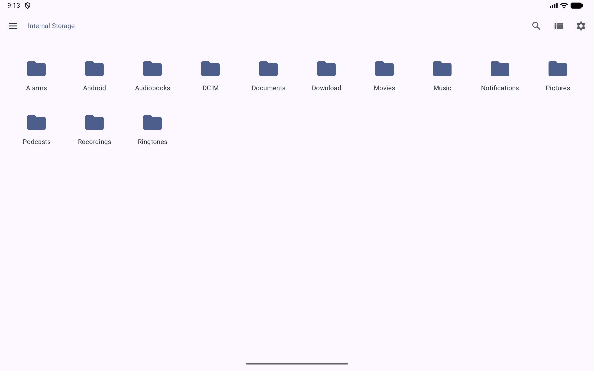
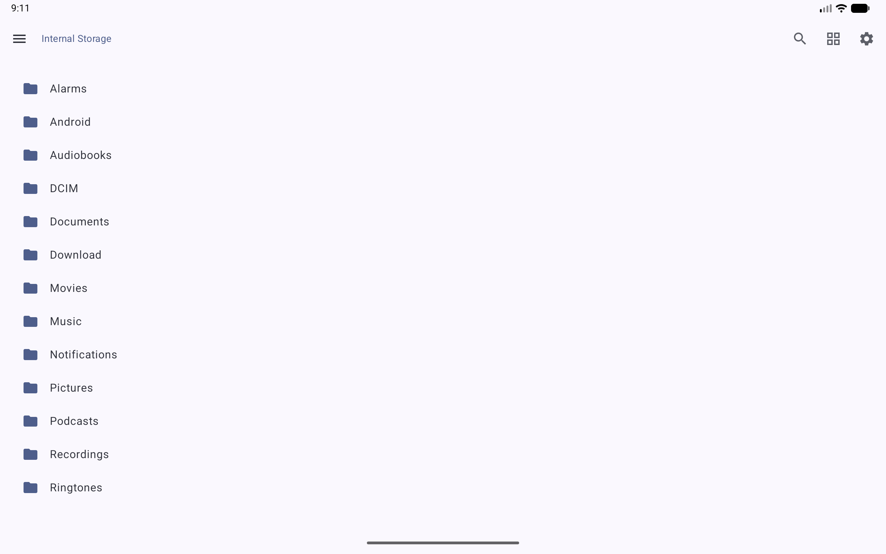
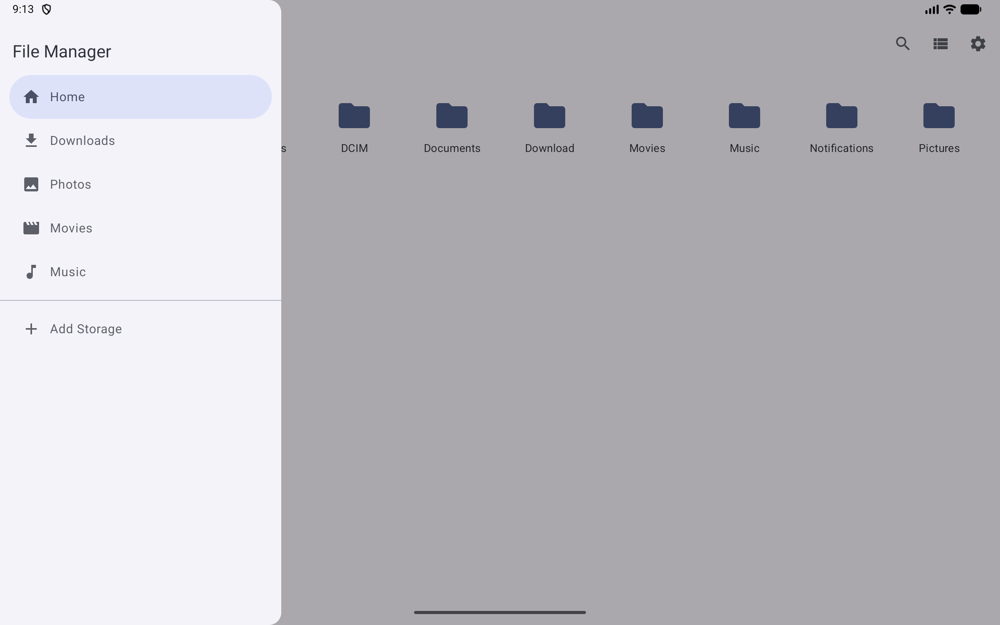

# MeldDrive 📂

[](https://opensource.org/licenses/Apache-2.0)
[](http://kotlinlang.org)
[](https://developer.android.com)
[](https://developer.android.com/jetpack/compose)

MeldDrive is a modern, powerful, and intuitive file management application for Android. It "melds" your local storage with various remote server protocols into a single, unified interface, making it easier than ever to manage your files across different platforms.

---

## 📸 Screenshots

<p align="center">
  
  
  
</p>

<p align="center">
  <i>Intuitive grid navigation | Detailed list layout | Quick access to all storages</i>
</p>

---

## 🚀 Features

- **Adaptive Layout**: Optimized for phones, tablets, foldables, and large screens using **Jetpack Compose** and **Navigation 3**.
- **Unified File Explorer**: Manage local device files and remote servers seamlessly in one place.
- **Multi-Protocol Support**:
    - [x] 📱 **Local Storage**: Full access to internal device storage.
    - [x] 🖥️ **SMB (Samba/Windows Sharing)**: Connect to PC or NAS servers.
    - [x] 🌐 **WebDAV (HTTP/HTTPS)**: Access cloud storage or private WebDAV servers with custom port and SSL trust options.
    - [ ] 📺 **DLNA** (Planned): Stream media from compatible devices.
- **Local Network Auto-Discovery**: Scan your local Wi-Fi network to discover SMB and WebDAV servers automatically using **NSD (mDNS)** and **NetBIOS**.
- **Remote Media Streaming & Video Thumbnails**: Stream video and audio files directly to external media players via `FileStreamProvider` and view video thumbnails powered by **Coil 3**.
- **View Modes & Filtering**: Switch between Grid and List views with real-time file search and sorting.
- **In-App Localization**: Support for dynamic language selection across supported locales.
- **Secure Storage**: Server credentials encrypted using **Google Tink** (AES-256 GCM).
- **MVI Architecture**: Robust, predictable state management using the Model-View-Intent pattern with Kotlin Flow.

## 🛠 Tech Stack

- **Language**: [Kotlin 2.4.20](https://kotlinlang.org/)
- **UI Framework**: [Jetpack Compose](https://developer.android.com/jetpack/compose) with Material 3 & [Navigation 3](https://developer.android.com/guide/navigation)
- **Dependency Injection**: [Hilt](https://dagger.dev/hilt/)
- **Database & Storage**: [Room](https://developer.android.com/training/data-storage/room) & [DataStore Preferences](https://developer.android.com/topic/libraries/architecture/datastore)
- **Networking & Protocols**:
    - [smbj](https://github.com/hierynomus/smbj) for SMB/CIFS support.
    - [OkHttp](https://square.github.io/okhttp/) for WebDAV support over HTTP/HTTPS.
- **Image & Video Loading**: [Coil 3](https://github.com/coil-kt/coil)
- **Security**: [Google Tink](https://github.com/tink-crypto/tink-java) for hardware-backed credential encryption.
- **Architecture**: MVI (Model-View-Intent) with Kotlin `StateFlow`
- **Code Quality & Verification**:
    - [Detekt](https://detekt.dev/) for static code analysis.
    - [Spotless](https://github.com/diffplug/spotless) (ktlint) for code formatting.
    - [Kover](https://github.com/Kotlin/kotlinx-kover) for test coverage reporting.

## 🏗 Build Requirements

- Android Studio Meerkat (or newer)
- JDK 17
- Android SDK 31+ (Minimum API level 31, Target SDK 35, Compile SDK 37)

## 📥 Getting Started

1. Clone the repository:
   ```bash
   git clone https://github.com/airdaydreamers/MeldDrive.git
   ```
2. Open the project in Android Studio.
3. Build and run the `app` module on an emulator or physical device.

### 🧪 Local Checks & Testing

Before opening a pull request, run the following Gradle tasks to verify your changes:

```bash
# Run unit tests
./gradlew testDebugUnitTest

# Run static analysis
./gradlew detekt

# Check & apply code style formatting
./gradlew spotlessApply
```

## 🤝 Contributing

We welcome contributions! Please review our [Contribution Guide](CONTRIBUTING.md) for details on commit message standards (Conventional Commits), PR templates, Mergeable rules, and local code style checks. All participants are expected to adhere to our [Code of Conduct](CODE_OF_CONDUCT.md).

## 📄 License

This project is licensed under the Apache License 2.0 - see the [LICENSE](LICENSE) file for details.

---

Developed with ❤️ by [Vladislav Smirnov](https://github.com/vladislav-smirnov)

```
Copyright © 2026 Vladislav Smirnov

Licensed under the Apache License, Version 2.0 (the "License");
you may not use this file except in compliance with the License.
You may obtain a copy of the License at

    http://www.apache.org/licenses/LICENSE-2.0

Unless required by applicable law or agreed to in writing, software
distributed under the License is distributed on an "AS IS" BASIS,
WITHOUT WARRANTIES OR CONDITIONS OF ANY KIND, either express or implied.
See the License for the specific language governing permissions and
limitations under the License.
```
